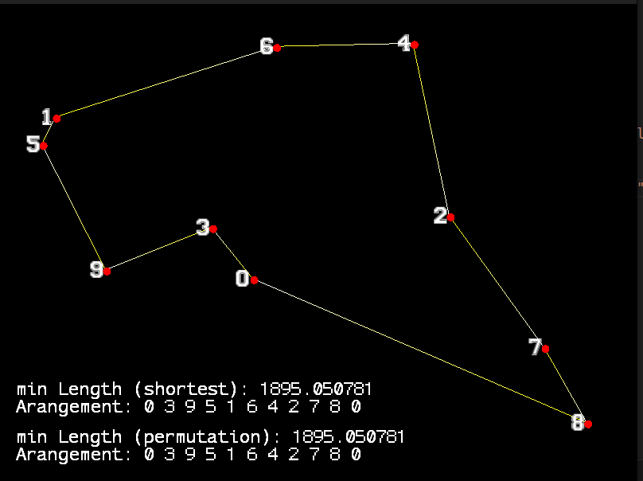

# Traveling Salesman

The Traveling Salesman Problem (TSP) is a classic optimization problem in computer science and mathematics. It involves finding the shortest possible route that allows a salesman to visit a set of cities exactly once and return to the original city. The challenge lies in the fact that the number of possible routes increases factorially with the number of cities, making it computationally difficult to solve as the number of cities grows. TSP has applications in logistics, planning, and the design of circuits, among other fields.

This project provides a modular c++ interface to develop and test algorithms. The routes aka the solutions of the individual algorithms are visualized with the SFML library. 


```bash
# installation of libraries
sudo apt-get install libsfml-dev
```

```bash
# compile project
cd /path/to/project
make
```

```bash
# run simulation
 ./traveling_salesman [number of points]
# ex.
./traveling_salesman 10
```

## Exampes


