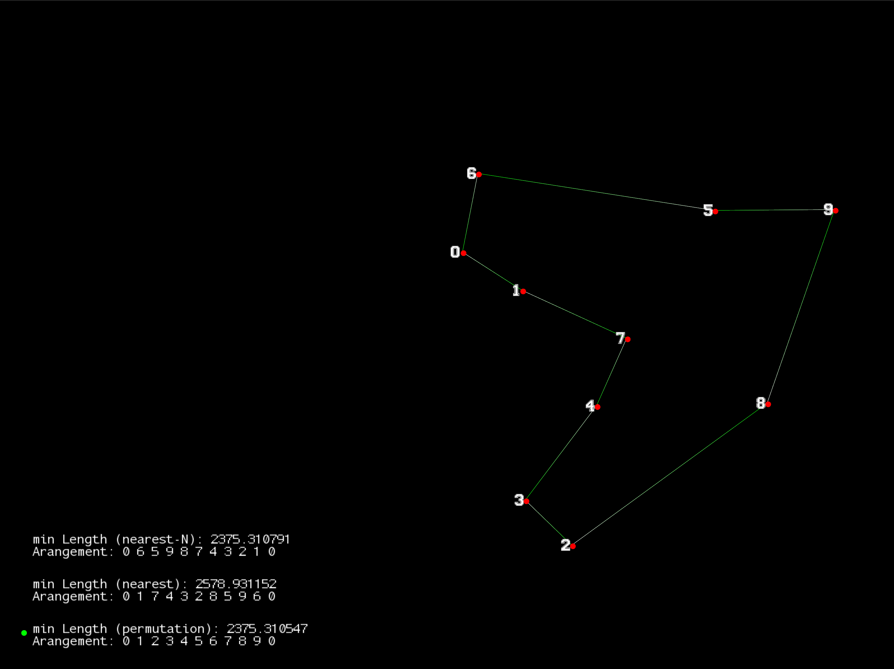
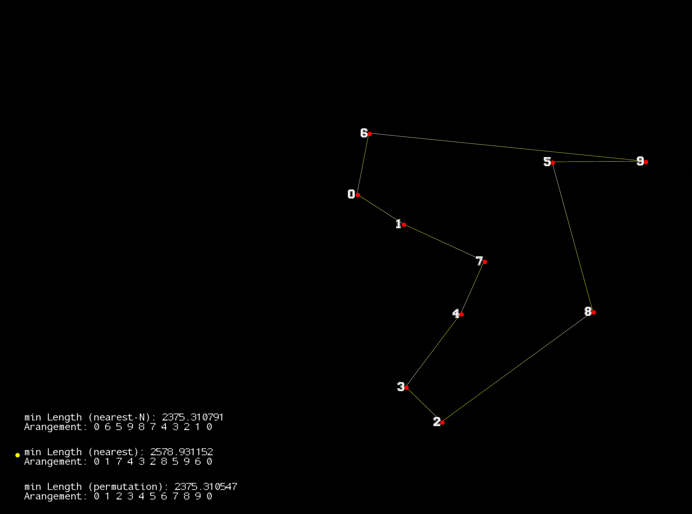

# Traveling Salesman

The Traveling Salesman Problem (TSP) is a classic optimization problem in computer science and mathematics. It involves finding the shortest possible route that allows a salesman to visit a set of cities exactly once and return to the original city. The challenge lies in the fact that the number of possible routes increases factorially with the number of cities, making it computationally difficult to solve as the number of cities grows. TSP has applications in logistics, planning, and the design of circuits, among other fields.

This project provides a modular c++ interface to develop and test algorithms. The routes aka the solutions of the individual algorithms are visualized with the SFML library. 


```bash
# install libraries
# ubuntu
sudo apt-get install libsfml-dev
sudo apt-get install libboost-all-dev

#fedora
sudo dnf install SFML-devel
sudo dnf install boost boost-devel

```


```bash
# compile project
cd /path/to/project
make
```

```bash
# run simulation
 ./traveling_salesman [number of points]
# ex.
./traveling_salesman 10
```

# Press the `↑` key to scroll up likewise `↓` to scroll down
## no selection


## exact solution (permutation)


## nearest neighbour of 0 


## nearest neighbour with different starting points. 


# How to create an own algorithm
```bash
# adding the source and header file
# see other algorithms for implementation
touch include/algo/{algo_name}.hpp
touch src/algo/{algo_name}.cpp
```

in `main.cpp` insert the following;
```c++
#include "../include/algo/{algo_name}.hpp"
```
create algorithm object
```c++
Algo_name algo_name(points);
```
and add to route
```c++
routes.emplace_back(Route(&algo_name, sf::Color::Blue,3)); //3 is the id
```
add the {algo_name}.cpp file to `makefile`
```
# Source files
SRCS = src/route.cpp \
       src/point.cpp \
       src/consts.cpp \
       src/bitset.cpp \
       src/main.cpp \
       src/algo/algo.cpp \
       src/algo/donothing.cpp \
       src/algo/permutation.cpp \
       src/algo/shortest.cpp \
       src/algo/shortestN.cpp \
       src/algo/{algo_name}.cpp \
```


